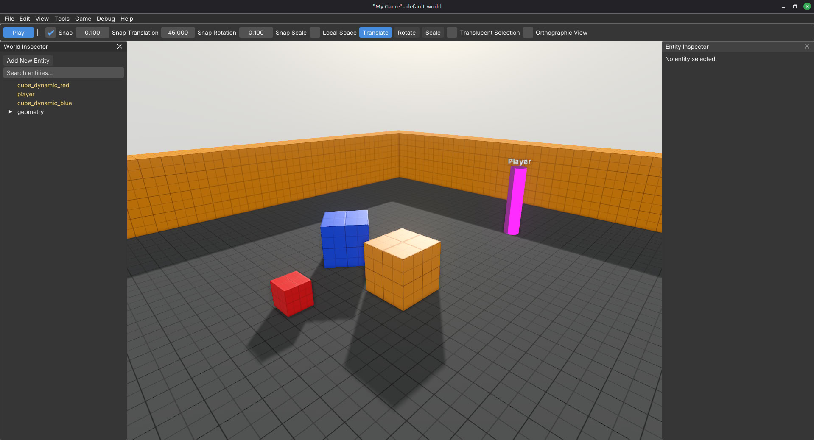
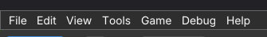
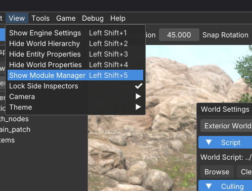
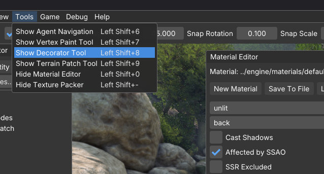
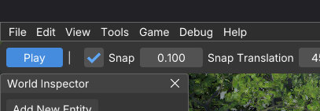
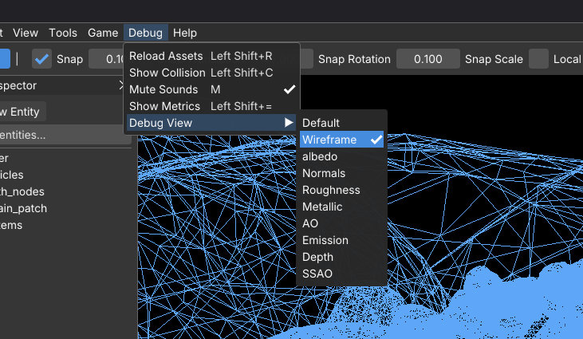
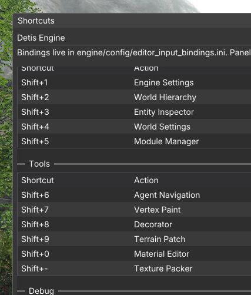
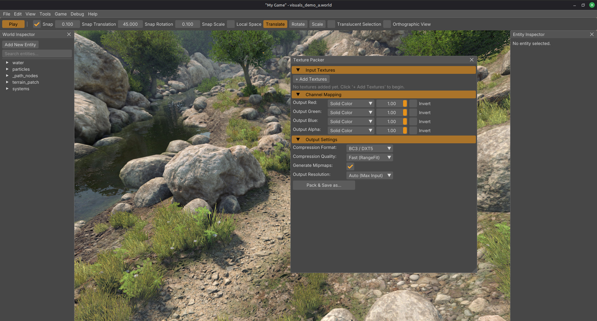

# Editor overview

This is a first look at the editor, not a manual for every tool. After [Quick start](quick_start.md) you already know Load World, Play, save, and undo. Here is how the rest of the workspace fits together.

The editor and the game are the same executable. You are always in one of two modes: **editor** (author) or **game** (play). Toggle with `Ctrl+P` / `Alt+P`, or **Game → Play Game**.

## What you are looking at

Think in four layers, top to bottom:

1. **Menu bar** at the top. **File**, **Edit**, **View**, **Tools**, **Game**, **Debug**, and **Help**. Almost everything in this guide is available from these menus. Shortcuts are accelerators for the same items (the menus show the keys next to each entry).
2. **Transform bar** under the menu. Day-to-day viewport controls: **Play** (dev mode), snap on/off and snap steps, **Local Space**, **Translate** / **Rotate** / **Scale** (same as `W` / `E` / `R`), **Translucent Selection**, and **Orthographic View** (with an ortho size field when that mode is on).
3. **Viewport** in the middle. This is the world. You fly the camera, select entities, and drag gizmos here.
4. **Panels** around it (hierarchy, inspector, settings, tools). Open them from **View** / **Tools** / **Debug**, or with the Shift shortcuts listed with those menus below.

The UI is meant to be functional and minimal. Prefer the **menu bar** when you are learning. Use shortcuts once the path is familiar. **Help → Shortcuts** is the full in-engine cheat sheet.

## Day-one loop

| You want to… | Menu (and shortcut) |
|--------------|---------------------|
| New world | **File → New** (`Ctrl+N`) |
| Load a world | **File → Load World** (`Ctrl+L`) |
| Save | **File → Save World** (`Ctrl+S`) |
| Save as | **File → Save World As...** (`Ctrl+Shift+S`) |
| Undo / redo | **Edit → Undo** (`Ctrl+Z`) / **Edit → Redo** (`Ctrl+Y` or `Ctrl+Shift+Z`) |
| Play the game | **Game → Play Game** (`Ctrl+P` or `Alt+P`), or **Play** on the transform bar |
| Back to editor | Same play toggle again |
| See all shortcuts | **Help → Shortcuts** |

> **Early Alpha Notice:** Undo and redo do not cover the Entity Inspector or most tool panels yet. They apply to viewport actions and the related shortcuts. Full inspector / panel undo is priority number one after release.

## Camera

In the viewport (perspective by default):

| Input | Action |
|-------|--------|
| Hold **RMB** | Look / fly |
| Hold **LMB** | Move / yaw |
| **WASD** / **Q** **E** | Move while holding RMB |
| **Mouse wheel** | Set fly speed |
| **F** | Focus selected |
| **Shift+F** | Frame all |
| **.** (period) | Focus world origin |
| Keypad **5** | Perspective / orthographic (same idea as **Orthographic View** on the transform bar) |
| Keypad **1** / **3** / **7** | Snap Front / Right / Top (`Ctrl` for the opposite side) |

**Alt+F** reveals the selection in the hierarchy.

These camera actions are also under **View → Camera** (perspective / ortho, focus origin, frame all, snap to axis). Shortcuts are listed next to the menu items.

## Selection and transforms

| Input | Action |
|-------|--------|
| Click in viewport | Select |
| **W** / **E** / **R** | Translate / Rotate / Scale gizmo |
| **T** | Local / world space |
| **Space** | Cycle gizmo mode |
| **Ctrl+D** | Duplicate |
| **Delete** | Delete selection |
| **Escape** | Deselect |
| **Ctrl+A** | Select all (**Edit → Select All**) |

The **transform bar** mirrors the common ones (mode, local space, snap) and also exposes:

- **Translucent Selection.** Let picks go through translucent surfaces when you need to select what is behind them.
- **Orthographic View.** Flat projection for alignment work. When enabled, set the ortho size on the bar. Keypad **5** and **View → Camera → Toggle Perspective/Orthographic** do the same mode.

Use the menu, the bar, or the keys. Same actions.

## File extras

Beyond new / load / save:

- **File → Export → World (GLB)** / **Selected Entities (GLB).** Dump meshes out for DCC tools.
- **File → Quit** (`Alt+F4`).

## Edit extras

Beyond undo / redo:

- **Edit → Select All** (`Ctrl+A`). Same as the selection table.
- **Edit → Frame All** (`Shift+F`). Frame every entity in the viewport.

## Core panels (View)

Open these from the **View** menu. Shortcuts are shown beside each item there.

| Menu | Shortcut | What it is for |
|------|----------|----------------|
| **View → Show Engine Settings** | `Shift+1` | Display, renderer, audio, and similar machine/user options |
| **View → Show World Hierarchy** | `Shift+2` | Entity tree for the loaded world |
| **View → Show Entity Properties** | `Shift+3` | Components and fields on the selection |
| **View → Show World Properties** | `Shift+4` | Settings for the current world |
| **View → Show Module Manager** | `Shift+5` | Lua modules loaded for the game |

**View → Lock Side Inspectors** keeps side panels from being shuffled away while you work.

**View → Camera** and **View → Theme** are covered in the Camera and Themes sections.

## Tools (when you need them)

Open these from the **Tools** menu. You do not need them on day one. Shortcuts are listed next to each entry.

| Menu | Shortcut | Tool |
|------|----------|------|
| **Tools → Show Agent Navigation** | `Shift+6` | Agent Navigation |
| **Tools → Show Vertex Paint Tool** | `Shift+7` | Vertex Paint |
| **Tools → Show Decorator Tool** | `Shift+8` | Decorator |
| **Tools → Show Terrain Patch Tool** | `Shift+9` | Terrain Patch |
| **Tools → Show Material Editor** | `Shift+0` | Material Editor |
| **Tools → Show Texture Packer** | `Shift+-` | Texture Packer |

Brush tools often use **Shift+LMB** (and variants). See **Help → Shortcuts** → Tool Brushes when you open one of those panels.

## Game

**Game → Play Game** (`Ctrl+P` / `Alt+P`). Enter game mode. Same toggle as the transform bar **Play** button when dev mode is on.

## Debug

Use the **Debug** menu. Shortcuts are shown next to the items.

| Menu | Shortcut | Action |
|------|----------|--------|
| **Debug → Reload Assets** | `Shift+R` | Reload assets |
| **Debug → Show / Hide Collision** | `Shift+C` | Collision / physics debug draw |
| **Debug → Show / Hide Metrics** | `Shift+=` | Performance metrics panel |
| **Debug → Mute Sounds** | **M** | Mute / unmute game sounds |

**Debug → Show Metrics** opens the performance metrics panel (FPS, timings, and related counters). Useful when something looks wrong or you dropped new files on disk.

**Debug → Debug View** switches render debug modes (buffer / channel views for diagnosing lighting and materials). Pick a mode from the submenu when you need to inspect why a surface looks wrong. Leave it on the normal view while authoring.

> **Early Alpha Notice:** Reload assets currently works for **shaders** and **scripts** only. Reloading 3D assets and configs is planned, but not available yet.

## Help

Everything here is menu-only (no required hotkeys). Open **Help** when you need them.

| Menu | What it is |
|------|------------|
| **Help → Shortcuts** | In-engine shortcut cheat sheet (bindings and tool brushes). Prefer this when you forget a key. |
| **Help → About** | Build / version info |
| **Help → Credits** | Credits |

## Themes

**View → Theme** switches editor chrome. Pick what you can stare at for hours. It does not change your game’s look.

## Next

**[Your first world](../tutorials/your_first_world.md).** Build a small level from scratch.
