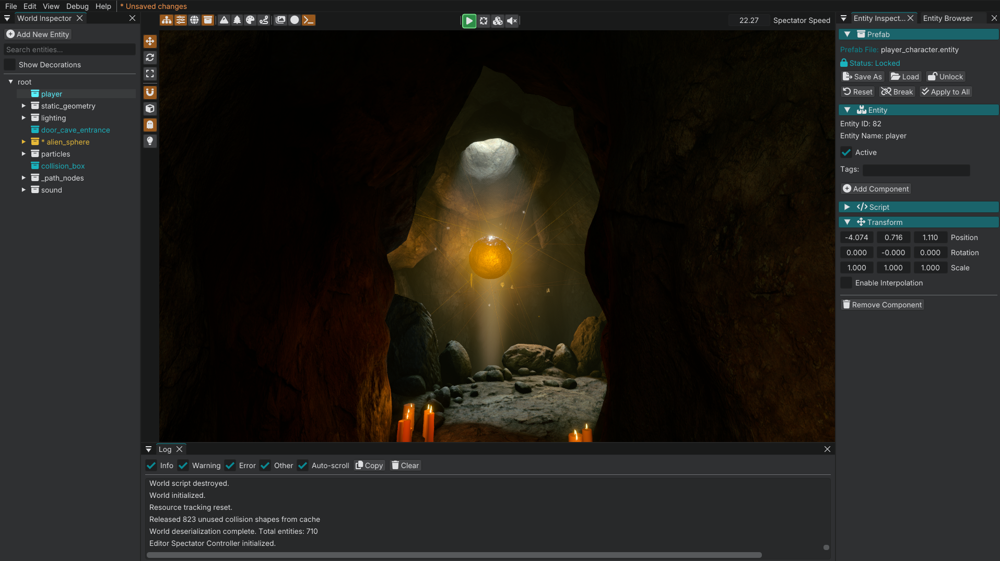

# Editor overview

After [Quick start](quick_start.md) you already know Load World, Play, save, and undo.

Daily work lives on the two toolbars around the viewport. You do not need the main menu to open inspectors, asset editors, or viewport tools.

## What you are looking at

1. **Viewport toolbar** (above the 3D view): inspectors, Entity Browser, viewport tools, Material Editor, Texture Packer, Log, **Play**, reload, collision debug, mute, and **Spectator Speed**.
2. **Transform rail** (left of the 3D view): gizmo mode, snap, local space, translucent selection, flat light.
3. **Viewport:** fly the camera, select entities, drag gizmos, drop prefabs from the Entity Browser.
4. **Docked panels:** World Inspector, Entity Inspector, World Settings, Entity Browser, and the rest. Open them from the viewport toolbar. Shortcuts still work.
5. **Menu bar:** **File**, **Edit**, **View**, **Debug**, **Help**. Use it for new / load / save, Settings, and a few extras that are not on the toolbar (Module Manager, Debug View, Performance Metrics).

Hover a toolbar button for its name and shortcut. **Help → Shortcuts** is the full cheat sheet. Bindings live in `engine/config/editor_input_bindings.ini`.

## Day-one loop

| You want to… | How |
|--------------|-----|
| New world | **File → New World** (`Ctrl+N`) |
| Load a world | **File → Load World** (`Ctrl+L`) |
| Save | **File → Save World** (`Ctrl+S`) |
| Save as | **File → Save World As...** (`Ctrl+Shift+S`) |
| Undo / redo | **Edit → Undo** (`Ctrl+Z`) / **Edit → Redo** (`Ctrl+Y` or `Ctrl+Shift+Z`) |
| Play / back to editor | Green **Play** on the viewport toolbar. `Ctrl+P` / `Alt+P` toggles both ways |
| Place a prefab | Entity Browser button on the viewport toolbar (`Shift+Space`), drag an `.entity` into the viewport |
| Settings / theme | **File → Settings**. See [Engine Settings](engine_settings.md) |
| See all shortcuts | **Help → Shortcuts** |

> **Early Alpha Notice:** Undo and redo cover viewport transforms, spawn, hierarchy, and similar commands. They do not cover every inspector field yet.

## Viewport toolbar

This is how you open editors. Click a button to show that panel. Click it again to hide it.

Left group, panels:

- World Inspector (`Shift+1`)
- Entity Inspector (`Shift+2`)
- World Settings (`Shift+3`)
- Entity Browser (`Shift+Space`)

Then exclusive viewport tools (only one at a time):

- Terrain Patch (`Shift+8`)
- Decorator (`Shift+7`)
- Vertex Paint (`Shift+6`)
- Agent Navigation (`Shift+9`)

Then asset editors and log:

- Texture Packer (`Shift+5`)
- Material Editor (`Shift+4`)
- Log (`Shift+-`)

Center:

- **Play** (enters game)
- **Reload Assets** (`Shift+R`)
- **Collision Debug** (`Shift+C`), cycles Off / Selected / All
- **Mute Sounds** (`M`). Mutes Game, Ambient, Voice, and music while editing. GUI keeps playing.

Far right: **Spectator Speed**. Mouse wheel while aiming also changes fly speed.

## Transform rail

Left of the 3D view:

| Control | Shortcut | What it does |
|---------|----------|----------------|
| Translate / Rotate / Scale | `W` / `E` / `R` | Gizmo mode. `Space` cycles. |
| Snap | `X` | Toggle. Right-click the magnet for translation / rotation / scale steps. |
| Local Space | `T` | Local vs world gizmo. |
| Translucent Selection | | Let picks go through translucent surfaces. |
| Flat Light | `Alt+2` | Dark-map fill while editing. Toggle off to return to the normal view. |

Orthographic view is **not** on this rail. Use Keypad **5** or **View → Viewport Camera → Toggle Perspective/Orthographic**.

## Camera

In the viewport (perspective by default):

| Input | Action |
|-------|--------|
| Hold **RMB** | Look / fly (perspective) or pan (ortho) |
| Hold **LMB** | Move / yaw (perspective) or rotate view (ortho) |
| **WASD** / **Q** **E** | Move while aiming |
| **Mouse wheel** | Zoom, or fly speed while aiming |
| **F** | Focus selected |
| **Shift+F** | Frame all |
| **Alt+F** | Reveal Selection in Hierarchy |
| **.** (period) | Focus world origin |
| Keypad **5** | Perspective / orthographic |
| Keypad **1** / **3** / **7** | Snap Front / Right / Top (`Ctrl` for Back / Left / Bottom) |

Same actions live under **View → Viewport Camera**.

## Selection and transforms

| Input | Action |
|-------|--------|
| Click in viewport | Select |
| **Ctrl+drag** | Box select (additive) |
| **W** / **E** / **R** | Translate / Rotate / Scale |
| **T** | Local / world space |
| **Space** | Cycle gizmo mode |
| **X** | Snap |
| **Ctrl+D** | Duplicate |
| **Delete** | Delete selection |
| **Escape** | Deselect |
| **Ctrl+A** | Select all |

Lights and other invisible entities are not pickable in the viewport yet. Select them in the World Inspector, then use the gizmo or **Transform** in the Entity Inspector.

## File

- **New World**, **Load World**, **Save World**, **Save World As...**
- **Export → World (GLB)** / **Selected Entities (GLB)**
- **Settings** — [Engine Settings](engine_settings.md). Appearance (**Theme**, **UI Scale (%)**), display, renderer (**Shadow Quality**), local lights (**Local Light Shadows**), audio mixer.
- **Quit** (`Alt+F4`)

## Edit

- **Undo** / **Redo**
- **Select All** / **Deselect All** (`Escape`)
- **Duplicate** / **Delete**

Frame All is under **View → Viewport Camera**, not Edit.

## View

Same panels and editors are on the viewport toolbar. You do not need this menu for daily work.

| Menu | Shortcut | What it is |
|------|----------|------------|
| **World Inspector** | `Shift+1` | Entity tree. **Add New Entity**, search, **Show Decorations**. Right-click: **Rename Entity**, **Group Selected Entities**, **Add Child Entity**, **Copy Entity Path**, **Move Up** / **Move Down** (`Shift+Up` / `Shift+Down`). |
| **Entity Inspector** | `Shift+2` | Components on the selection |
| **World Settings** | `Shift+3` | Sun, sky (**Ambient Lux**, IBL), exposure, soundscape, **Default Sound Zone**, world script |
| **Material Editor** | `Shift+4` | Materials |
| **Texture Packer** | `Shift+5` | Texture packing |
| **Viewport Tool** | | **None**, **Vertex Paint**, **Decorator**, **Terrain Patch**, **Agent Navigation**. Exclusive. |
| **Module Manager** | `Shift+0` | Lua modules from `modules.ini` |
| **Entity Browser** | `Shift+Space` | Prefab library. Drag into the viewport or onto the World Inspector |
| **Viewport Camera** | | Perspective / ortho, focus, frame, snap |
| **Reset Editor Layout** | | Restore World Inspector, Entity Inspector, and Log. Close other panels |

Brush tools often use **Shift+LMB**. See **Help → Shortcuts** → Tool Brushes.

## Placing prefabs

The default way to put content in a world is the **Entity Browser**, not **Add New Entity**.

1. Click the Entity Browser button on the viewport toolbar (`Shift+Space`).
2. Search, or walk the tree (prefabs live under `content/entities/`).
3. Drag an `.entity` into the **viewport**. It spawns where you drop.
4. Drop onto an entity in the World Inspector to spawn it as a child.
5. Double-click spawns a root at the origin.

The instance name comes from the file stem, made unique (`plane`, `plane_2`). Right-click in the World Inspector → **Rename Entity** if you want a different name.

Use **Add New Entity** when you are authoring a new prefab from components. That is [Your first prefab](../tutorials/your_first_prefab.md). **Prefab → Load** on an existing entity still works if you already created the entity and want to keep its name.

## Debug

**Play**, **Reload Assets**, **Collision Debug**, and **Mute Sounds** are on the viewport toolbar. **Flat Light** is on the transform rail.

| Menu | Shortcut | What it does |
|------|----------|----------------|
| **Play Game** | `Ctrl+P` / `Alt+P` | Same as the green **Play** button. Also returns to the editor |
| **Log** | `Shift+-` | Log panel |
| **Reload Assets** | `Shift+R` | Shaders, textures, materials, flipbooks, sounds, animations, scripts/modules, themes, property defaults, surface types, and editor input bindings. Does **not** run on file save. |
| **Toggle Collision Debug** | `Shift+C` | Off / Selected / All |
| **Mute Sounds** | `M` | Mute Game / Ambient / Voice / music in the editor. GUI keeps playing |
| **Performance Metrics** | `Shift+=` | FPS and timings. Only when `dev_mode` is on in `default_game.ini` |
| **Debug View** | `Alt+1` … | Buffer / lighting debug modes. **Flat Light** is also on the transform rail |

## Help

| Menu | What it is |
|------|------------|
| **Shortcuts** | In-engine cheat sheet |
| **Documentation** | Opens the docs URL if `help.documentation_url` is set in the editor ini |
| **End-User License Agreement** | EULA |
| **About** | Version |
| **Credits** | Credits |

## Next

**[Your first world](../tutorials/your_first_world.md).** Build a small level from scratch.
