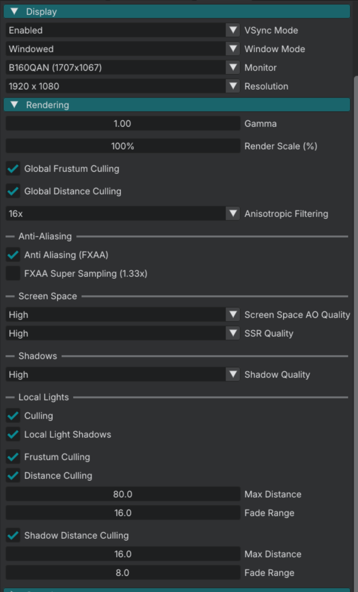

# Engine Settings

Before you continue, make sure Detis runs well on your hardware. If the editor or a demo is slow or the image looks wrong, open **File → Settings**.

The controls below are in that window.

**Reset to Defaults** replaces the live engine settings with the shipped defaults. Restart after using it.

## Appearance

| Setting | What it does |
|---------|----------------|
| **Theme** | Editor color theme. |
| **UI Scale (%)** | Editor UI size. |

## Display

| Setting | What it does |
|---------|----------------|
| **VSync Mode** | **Disabled**, **Enabled**, or **Adaptive**. |
| **Window Mode** | **Windowed**, **Fullscreen**, or **Borderless**. |
| **Monitor** | Which display to use. Shown when more than one monitor is connected. |
| **Resolution** | Output resolution. |

## Rendering

| Setting | What it does |
|---------|----------------|
| **Gamma** | Output gamma. Range 0.01 to 3. |
| **Render Scale (%)** | Internal render resolution as a percent of the output. |
| **Global Frustum Culling** | Drops objects outside the camera frustum. |
| **Global Distance Culling** | Drops objects beyond the distance cull range. |
| **Anisotropic Filtering** | Texture filtering. **Off**, **2x**, **4x**, **8x**, **16x**. |

### Anti-Aliasing

| Setting | What it does |
|---------|----------------|
| **Anti Aliasing (FXAA)** | Enables FXAA. |
| **FXAA Super Sampling (1.33x)** | Renders at 4/3 and downsamples after FXAA. Requires FXAA. |

### Screen Space

| Setting | What it does |
|---------|----------------|
| **Screen Space AO Quality** | Ambient occlusion quality. **Off**, **Low**, **Medium**, **High**. |
| **SSR Quality** | Screen-space reflections quality. **Off**, **Low**, **Medium**, **High**. |

### Shadows

| Setting | What it does |
|---------|----------------|
| **Shadow Quality** | Sun cascaded shadow maps and local-shadow distances. **Off**, **Low**, **Medium**, **High**, **Ultra**. Changing it needs a restart for map resolution and cascade count. |

| Shadow Quality | Cascades | Sun shadow distance | Local shadow max / fade |
|----------------|----------|---------------------|-------------------------|
| Off | — | — | — |
| Low | 1 | 50 m | 10 / 5 |
| Medium | 2 | 100 m | 14 / 7 |
| High | 3 | 100 m | 16 / 8 |
| Ultra | 3 | 200 m | 24 / 12 |

Those distances are written when settings load.

### Local Lights

| Setting | What it does |
|---------|----------------|
| **Culling** | Master switch for local-light culling. **Frustum Culling** and **Distance Culling** require this. |
| **Local Light Shadows** | Global switch for Point and Spot shadow maps. Per-light **Cast Shadows** must also be on. |
| **Frustum Culling** | Drops local lights outside the camera frustum. |
| **Distance Culling** | Drops local lights beyond **Max Distance**. |
| **Max Distance** / **Fade Range** | Light (not shadow) distance fade. |
| **Shadow Distance Culling** | Culls local shadow maps by distance. Requires **Local Light Shadows**. |
| **Max Distance** / **Fade Range** (shadow) | Shadow-map distance fade. |

## Sound

Sliders are shown in dB and stored as linear gain.

| Setting | What it does |
|---------|----------------|
| **Master Volume** | Output level after all other volumes. |
| **Music Volume** | Music stream. |
| **SFX Volume** | Game category (footsteps, impacts, interactions). |
| **UI Volume** | GUI category (menus and HUD). |
| **Ambient Volume** | Ambient category (soundscapes and environment beds). |
| **Voice Volume** | Voice category (dialogue). |
| **Reverb** | Enables the shared reverb. Room size and send live on Sound Zones. |

## External Tools

| Setting | What it does |
|---------|----------------|
| **Script Editor** | External software to open/edit scripts. |
| **Texture Editor** | External software to open/edit images. |
| **Audio Editor** | External software to open/edit sound files. |

**Browse** sets the path. **Clear** removes it.

## Next

**[Project layout](project_layout.md).** Where your work lives on disk.
