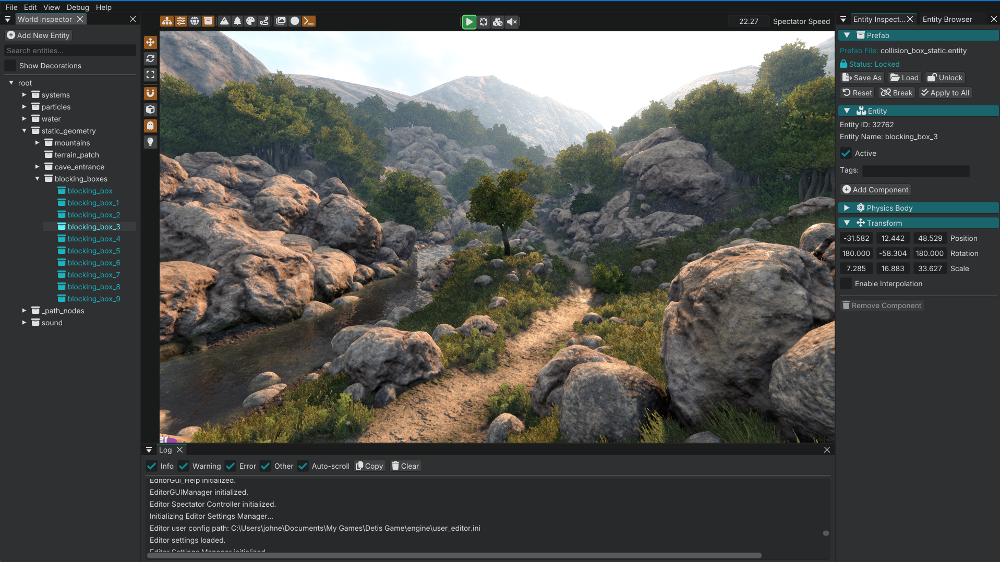

# Detis Engine

A game engine built from the ground up for small indie teams and solo developers making single-player 3D PC games.

This documentation is designed to get you up and running with the Detis toolset.

For **platforms**, **recommended hardware**, **units**, and **axes**, see [Engine reference](engine_reference.md).

## Continue reading

**Next:** [FAQ](faq.md): what Detis is (and is not) before you install.
