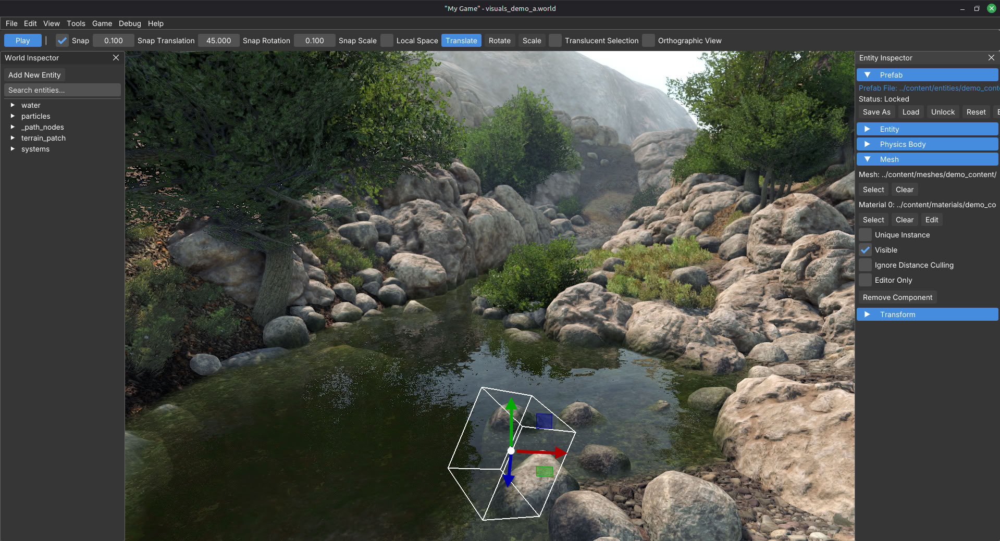

# Detis Engine

**Spend your time making games, not fighting your engine.**

Detis Engine is a **focused, lightweight game engine designed for rapid iteration**. Built by a game dev veteran, Detis is **an opinionated toolset tailored for single-player 3D PC games.** There are no heavy import pipelines, no endless menu mazes, no shader compilation delays, and no C++ build plumbing to babysit.

Drop in your assets, author your worlds in the built-in live editor, script fast with real-time Lua hot-reloading, and hit play. All in a single executable. Build 3D PC games without the engine getting in your way.

## Built for Production, Shared with the World ## 

Although **initially built as an internal tool** to power a specific 3D game, strong interest from other game developers prompted the decision to release Detis publicly.

Detis includes a **full visual 3D editor** alongside its **Lua API**, giving you a complete environment to build 3D games and iterate rapidly. Exactly because it originated as an internal tool, some peripheral workflows favor simplicity over complex UI suites. For example, rather than maintaining a heavy asset browser, Detis relies on your OS file manager.

These "rough edges" are intentional trade-offs for raw speed, a minimal footprint, and zero clutter. As the project grows, the toolset will continue to be refined and expanded based on real-world feedback.

> **Early Alpha Notice:** Detis is under active development. While it is exceptionally stable compared to many engines out there, expect occasional bugs, API refinements, and additional feature additions as development advances.

## Why Choose Detis Engine?

- **Zero-Friction Iteration:** The editor and game live in the same app. Toggle seamlessly between editing and playtesting instantly in a unified viewport.
- **Direct Asset Pipeline:** Drop in standard **glTF / GLB** models and **DDS** textures directly. No slow import processes, what you drop in is what you have.
- **Complete Core Feature Set:** Everything you need to build a full game out of the box, including level editing tools, physics, a PBR renderer, 3D audio, animation, and AI pathfinding.
- **Focus on Gameplay, Not Engine:** Script in lightweight Lua with full API access and instant hot-reloading. Spend your time crafting game logic rather than managing C++ compilation.
- **Human-Readable & AI-CoPilot Projects:** World files, materials, scripts, and shaders are stored as plain text (JSON, `.mat`, `.lua`, `.glsl`). Read, diff, and version-control them easily with Git, or drop the project folder into AI coding tools like Claude or Cursor to let them write gameplay code for you.
- **Self-Contained Workspace:** One folder **is** your game. No launcher bloat, no forced background services, and no project manager software.

## Is Detis Engine Right for Your Project?

### Perfect for:
* **Target Platforms:** Native 64-bit **Windows** and **Linux** desktop.
* **Game Scope:** 3D, single-player, level-based PC games.
* **Team Size:** Solo developers and small indie teams who want a tight, manageable toolset.
* **Pragmatic Devs:** Developers who prefer coding in Lua over drag-and-drop visual scripting, and prioritize fast startup times, lean tools, and direct control over bloat.
* **Authored content:** Devs building handcrafted worlds / set pieces, not endless procedural open worlds. 
* **Pure Utility:** A functional, minimalist UI built for raw developer speed and stability rather than flashy editor graphics.

### Look Elsewhere If You Need:
* **Mobile, Console, or Native 2D:** Detis is currently a 3D desktop PC engine.
* **Multiplayer or Massively Open Worlds:** Detis is built specifically for level-based, single-player experiences.
* **AAA Photorealism:** Features a solid PBR renderer, but deliberately skips bleeding-edge graphics tech to prioritize performance and iteration speed.
* **Built-in Storefront:** There is no internal asset marketplace or package manager.
* **Native C++ Engine Source:** The indie tier is binary and Lua-focused. Engine source code is not currently available. 
* **Visual Scripting Focus:** If you don't want to write code or rely entirely on drag-and-drop visual scripting, you will be much better off starting with a mainstream, general-purpose engine.

## Recommended order

Read these in sequence. Each page links only to the next step at the bottom.

1. **[Installation](installation.md)**
2. **[Quick start](quick_start.md)**
3. **[Project layout](project_layout.md)**
4. **[Sample content](sample_content.md)**
5. **[Editor overview](editor_overview.md)**
6. **[Your first world](../tutorials/your_first_world.md)**
7. **[Your first prefab](../tutorials/your_first_prefab.md)**

More guides will be added as we write them.

> **System Requirement Note:** Detis Engine is optimized for modern 64-bit PC setups with a dedicated discrete GPU.

## Next

**[Installation](installation.md).** Download and get up and running.
