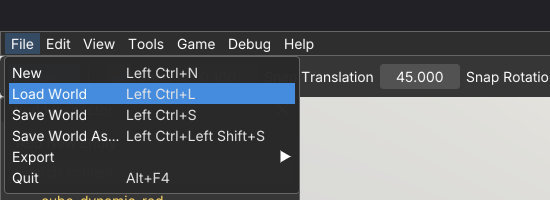
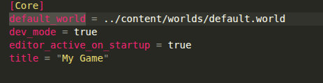

# Quick start

Goal: run your engine copy, play a demo, then edit the world and save.

If you have not extracted the package yet, see [Installation](installation.md) first.

## 1. Run your copy

Open `game/bin` and run `detis_engine`.

**This copy is** already **your game**. You do not create a project elsewhere.

The app starts in the **editor** by default. Editor and game are the same executable.

## 2. Know where your work lives

| Path | What you change |
|------|-----------------|
| `game/content/` | Worlds, scripts, meshes, game config. **Your game.** |
| `game/engine/` | Engine builtins. Leave alone unless you know why. |
| `game/bin/` | Executable. Run from here. |

File dialogs open under `content/` by default.

## 3. Play a demo



1. **File → Load World** (or `Ctrl+L`).
2. Open `worlds/demo_content/visuals_demo_a.world` (the visuals demo).
3. Press **`Ctrl+P`** or **`Alt+P`** to enter **game** mode and play.
4. Press **`Ctrl+P`** or **`Alt+P`** again to return to the **editor**.

**Play Game** in the menu does the same toggle.

## 4. Edit, save, undo

Back in the editor:

1. Click something obvious in the viewport (a rock or similar prop).
2. Move it with the translate gizmo (`W`).
3. **File → Save World** (or `Ctrl+S`).
4. To reverse the move, **Edit → Undo** (or `Ctrl+Z`). Save again if you want that undo written to disk.

Redo is `Ctrl+Y` or `Ctrl+Shift+Z`.

Press `Ctrl+P` / `Alt+P` again to check the change in game mode.

## 5. Optional: open that demo on startup



The world loaded at launch is set in `game/content/config/default_game.ini`:

```ini
[Core]
default_world = ../content/worlds/default.world
```

Point it at the visuals demo (or any world you prefer):

```ini
[Core]
default_world = ../content/worlds/demo_content/visuals_demo_a.world
```

Restart the executable after you save the file. On the next launch the editor should open with that world already loaded.

## Next

**[Project layout](project_layout.md).** Where your work lives on disk.
