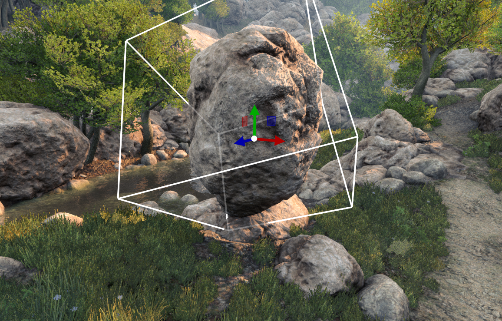

# Quick start

**Goal:** run the editor, walk around a demo **world**, move one object, save, and press Play again. 

## 1. Run your copy

Open `game/bin` and run `detis_engine`.

**This copy is already your game.** You do not create a project elsewhere.

The app starts in the **editor**. Editor and game are the same executable. The world from `content/config/default_game.ini` is already loaded (shipped default: `worlds/default.world`).

1. **File → Load World** (`Ctrl+L`).
2. Open `worlds/demo_content/visuals_exterior_demo.world`.
3. Press **`Ctrl+P`** or **`Alt+P`** (or the green **Play** button) to enter **game** mode.
4. Press `Ctrl+P` / `Alt+P` again or Escape to return to the **editor**.

## 2. Edit, save, undo

Back in the editor:

1. Click something in the viewport (a rock or similar prop).
2. Move it with the **translate** arrows on the object (press **`W`**, or click the move button on the left transform rail).
3. **File → Save World** (`Ctrl+S`).
4. To reverse the move, **Edit → Undo** (`Ctrl+Z`). Save again if you want that undo written to disk.

Redo is `Ctrl+Y` or `Ctrl+Shift+Z`.

Press `Ctrl+P` / `Alt+P` again to check the change in game mode.




## 3. Optional: open that demo on startup

The world loaded at launch is set in `game/content/config/default_game.ini`:

```ini
[Core]
default_world = ../content/worlds/default.world
```

Point it at the exterior visuals demo (or any world you prefer):

```ini
[Core]
default_world = ../content/worlds/demo_content/visuals_exterior_demo.world
```

Restart the executable after you save the file.

## Continue reading

**Previous:** [Installation](installation.md): run your engine copy.

**Next:** [Project layout](project_layout.md): where your game files live on disk.
