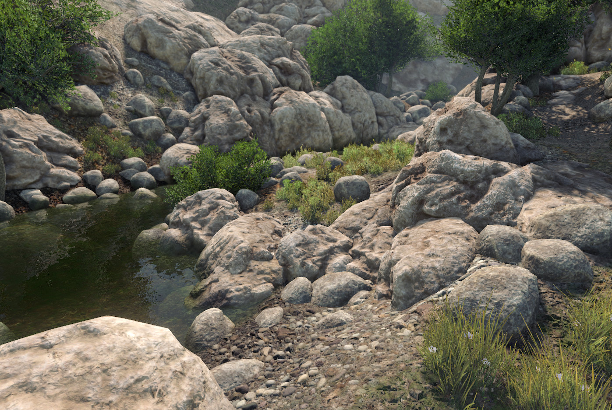

# Sample Content

Detis engine ships loaded with **working demo worlds**, **sample Lua scripts**, and **example assets** so you can dive into a playable project on day one and see how everything fits together. Think of this page as a quick map of what's included and where to find it.

All included game assets are **CC0**. You'll find a license file inside each asset folder. You are free to use and modify these assets in games you build with Detis Engine. Feel free to modify, rewrite, or delete any sample content as you build your game. 

## How to Use the Sample Content

* **Learn by tweaking:** Break working examples to see how they work.
* **Jump right in:** Run the demo scenes referenced in the [Quick Start](quick_start.md) guide.
* **Steal good patterns:** Copy the provided scripts and entity setups straight into your own projects.
* **Build directly on top of it:** You can grow your game right inside this `game/content/` folder structure.

## A Few Quick Rules of Thumb

* **It’s all yours:** This isn't a separate or "protected" package. It’s just starter content inside **your** engine directory.
* **Clean separation:** Everything game-related lives under `content/`. The engine's low-level internals stay tucked away under `engine/`.
* **Focus on structure here:** We'll dive into the deeper API and scripting mechanics in later guides.

## Sample Lua Scripts

Gameplay in Detis is driven by **Lua**. The project includes a lean, working codebase inside `content/scripts/`:

| Path | Purpose |
|------|---------|
| `content/scripts/_templates/` | Starter templates to copy whenever you create a new world, entity, or module script. |
| `content/scripts/worlds/demos/` | World scripts powering the demo maps (handling visuals, physics, UI, and navigation). |
| `content/scripts/player/` | A fully functional first person player controller, camera, HUD, and interaction setup. |
| `content/scripts/shared/` | Shared utility scripts and UI widgets used across the demos. |
| `content/scripts/modules/` | Core game modules registered in `content/config/modules.ini`. |
| `content/scripts/components/` | Custom entity script components. |

## Next

**[Editor overview](editor_overview.md).** Menus, transform bar, and panels.
