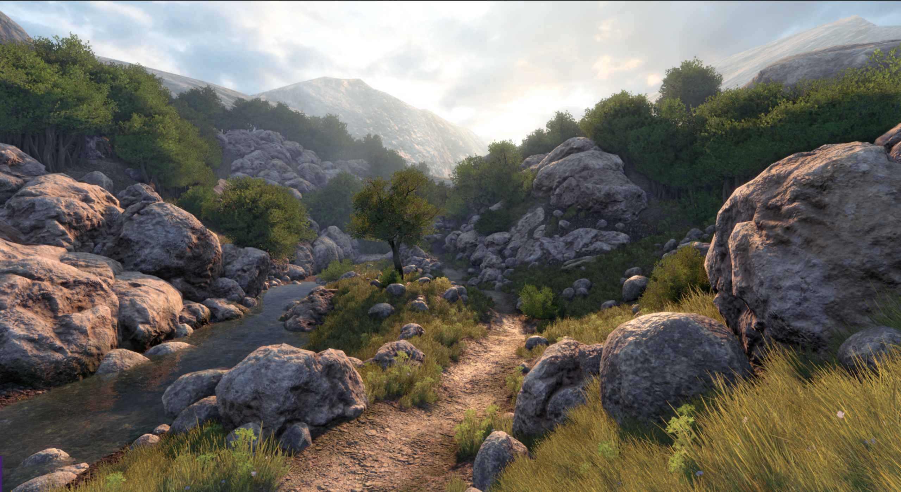

# Sample content

The package ships with **working demo worlds**, **prefabs**, **sample Lua**, and **example assets** so you can play something on day one. You can ignore all of it and replace it with your own work over time.

Shipped content is meant to be used inside Detis only. Use it in games you build with this engine, not as a general asset pack for other tools.

Other than that, any third party assets are **CC0**, meaning they are free to use in your games. There is a license file inside each of those third party folders. 

Feel free to move, modify, rewrite, or delete sample content as you build your game.

## Demo worlds

Under `content/worlds/demo_content/`:

| World | What it shows |
|-------|----------------|
| `visuals_exterior_demo.world` | Outdoor lighting, foliage, set dressing |
| `visuals_interior_demo.world` | Interior lighting and space |
| `materials_demo.world` | Material variety |
| `physics_demo.world` | Physics bodies |
| `interactions_demo.world` | Interactables and the demo player |
| `animation_demo.world` | Skeletal animation |
| `gui_demo.world` | In-game UI |
| `navigation_demo.world` | Nav and agents |
| `detection_demo.world` | Detection agents |
| `modules_demo.world` | Module scripts |

`content/worlds/default.world` is the startup world in `default_game.ini`.

## Prefabs

`.entity` files under `content/entities/`. The Entity Browser lists them.

| Path | Use |
|------|-----|
| `entities/primitive/` | Plane, cube, cylinder, pyramid |
| `entities/lights/` | Point and spot lights |
| `entities/demo_content/` | Characters, props, foliage, cave pieces, particles, systems |

## Sample Lua

Under `content/scripts/`:

| Path | Purpose |
|------|---------|
| `_templates/` | Starters to copy for world, entity, or module scripts |
| `worlds/demos/` | World scripts for the demo worlds |
| `player/` | First-person player, camera, HUD, interaction |
| `components/` | Reusable entity scripts (doors, lamps, interactables, agents) |
| `modules/` | Game-wide modules listed in `content/config/modules.ini` |
| `shared/` | Helpers and UI widgets |
| `camera_effects/` | Post / camera effect scripts used by the camera-effects module |

## Continue reading

**Previous:** [Project layout](project_layout.md): `bin`, `content`, and `engine`.

**Next:** [Editor overview](editor_overview.md): menus, toolbars, and panels.
