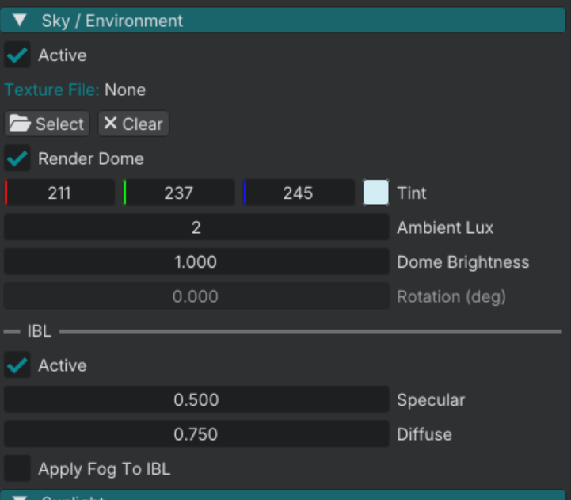

# Sky texture

The visible sky dome and reflection environment can use a **2:1 equirectangular DDS** assigned in **World Settings**. This page covers authoring that file. **Ambient Lux**, sun **Lux**, IBL strengths, and exposure are in the [Lighting](lighting.md) manual.

## Author the DDS

| Rule | Value |
|------|--------|
| Aspect | 2:1 (for example 2048×1024) |
| Format | BC3 DDS |
| Export | Gamma on, sRGB on, mipmaps on |
| Naming | `{name}_sky.dds` |

See [Textures](art_textures.md) for GIMP export detail.

**HDRI sources:** Export or tonemap in your DCC to an LDR equirect DDS today. A dedicated **Import HDRI** editor tool is planned but not shipped yet.

## Assign in the editor

1. **View → World Settings** (`Shift+3`).
2. Open **Sky / Environment**.
3. Enable **Active** if the sky system is off.
4. Browse **Texture File** to your `.dds` under `content/textures/`.

The file dialog accepts `.dds` only.

## Presentation vs lighting

| Control | Art / presentation | Lighting manual |
|---------|-------------------|-----------------|
| **Texture File** | Which panorama draws on the dome | — |
| **Render Dome** | Show or hide the visible sky | — |
| Rotation, tint, brightness, contrast | Grade the texture | Pair with exposure |
| **Ambient Lux** | — | Sky fill illuminance |
| **IBL** Active / Specular / Diffuse | — | Reflections and diffuse from baked cubemap |

Scene fill for gameplay is **Ambient Lux**, not IBL alone. IBL adds specular and diffuse from an environment cubemap the engine **bakes from your sky texture at load**. That is why [Your first world](/tutorials/your_first_world.md) enables both fill and IBL.

With **Texture File** empty, the dome can still use flat tint color from the same panel. Procedural sky modes are not in the shipping engine yet.

## Reload

After replacing the DDS on disk, use **Debug → Reload Assets** (`Shift+R`). Sky IBL rebuilds from the current texture when the sky file is set.

## Continue reading

**Previous:** [Material Editor](art_material_editor.md): edit `.mat` files in the editor.

**Next:** [Scripting overview](script_overview.md): entity, world, and module scripts.
