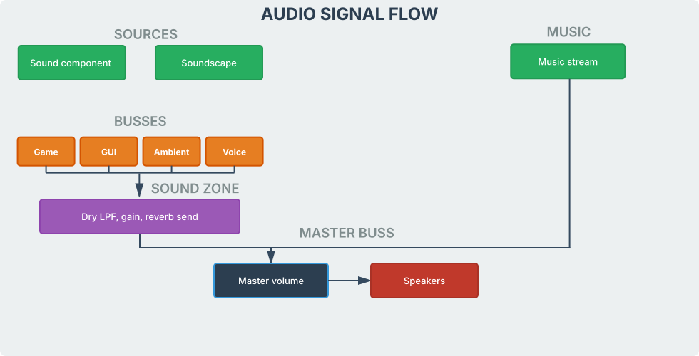

# Audio

Detis audio is built into the engine and supports all the essential concepts such as spatial SFX on entities, ambient soundscapes, listener-based **Sound Zones**, category mixing, and streamed music while remaining simple to use. You do not need to install any complex middleware stack on the side. 

## Categories (Busses)

Every in-game sound (except music which uses its own buss) uses one category. You pick it on the Sound component in the editor.

| Category | Engine Settings slider | Use |
|----------|------------------------|-----|
| **Game** | **SFX Volume** | Footsteps, impacts, interactions. |
| **GUI** | **UI Volume** | Menus and HUD. Cannot join Sound Zones. |
| **Ambient** | **Ambient Volume** | Soundscapes and environment beds. |
| **Voice** | **Voice Volume** | Dialogue. |

Think of a category as **which group owns this sound**. Assign footsteps to **Game** and they ride **SFX Volume** with every other Game sound. Turn that slider down and the whole group goes down together. You control those category levels in **File -> Settings**. Inside Sound Zones, the category also picks which **reverb send** row applies (Game vs Ambient vs Voice).

## Pause behavior

When the player pauses the game, the **same category groups** decide what pauses with the world and what keeps playing.

- **Game**, **Ambient**, and **Voice** pause. They resume when the game unpauses.
- **GUI** does not pause with the game.
- **Music** does not pause with the game. Use the music API if a pause menu should silence the track.

## Signal flow

## Script API reference

- [Sound](../reference/sound.md)
- [Music](../reference/music.md)
- [Sound zone](../reference/sound_zone.md)
- [Soundscape zone](../reference/soundscape_zone.md)
- [World soundscape](../reference/world_soundscape.md)
- [World soundzone](../reference/world_soundzone.md)

## Continue reading

**Previous:** [Detis Engine Manual](index.md): manual home.

**Next:** [Sound component](audio_sound_component.md): add a Sound component and play from Lua.
