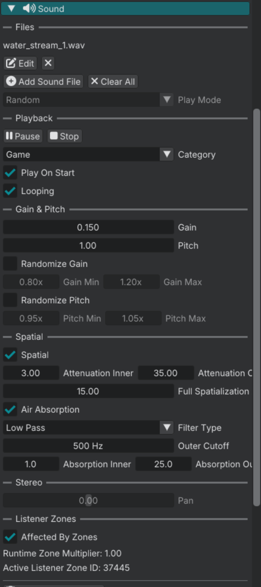

# Sound component

The Sound component plays audio from an entity. Most of the time you use it for **spatial** in-game sounds: footsteps, doors, machines, and other effects that should get louder or quieter as the player moves. Turn **Spatial** on and the engine uses the **Transform** component for 3D position and distance falloff.

You can also leave **Spatial** off and play a **stereo** (2D) clip with **Pan** for left/right balance. That path is less common for world props.

## Basic setup

1. Select an entity.
2. Add a Sound component.
3. Assign one or more audio files.
4. Set **Category** (Game, GUI, Ambient, Voice).
5. Play with `sound_play(entity_id)` from a script, or enable **Play On Start**.

## Properties

| Widget | Purpose |
|--------|---------|
| **Files** | Audio files on this component (`.wav` preferred`). |
| **Play Mode** | How to pick a file when more than one is assigned. **Random**, **Forward**, or **Backward**. Default is Random. Disabled until two files are assigned. |
| **Category** | Game, GUI, Ambient, or Voice. |
| **Play On Start** | Play when the entity activates. |
| **Looping** | Repeat until stopped. |
| **Gain** | Linear loudness, 0 to 1. |
| **Pitch** | Playback rate (0.5 is half speed, 2.0 is double). |

## Spatial audio

| Widget | Purpose |
|--------|---------|
| **Spatial** | 3D positioning from the entity transform. Needs a Transform component. |
| **Attenuation Inner** | Radius where volume stays full. |
| **Attenuation Outer** | Distance where the sound fades out. |
| **Full Spatialization At** | Distance where panning reaches full 3D. This is to prevent hard panning when close to the source. |
| **Pan** | Left/right when **Spatial** is off. Disabled when Spatial is on. |

## Air absorption

Frequency content loss over distance. Only applies when **Spatial** is on.

| Widget | Purpose |
|--------|---------|
| **Air Absorption** | Turn distance filtering on. |
| **Filter Type** | **Low Pass** or **High Pass**. |
| **Outer Cutoff** | Filter frequency at the outer radius. |
| **Absorption Inner** | Distance where filtering starts. |
| **Absorption Outer** | Distance where filtering is full. |

## Variation

| Widget | Purpose |
|--------|---------|
| **Randomize Gain** | Vary loudness on each play. |
| **Gain Min** / **Gain Max** | Linear multipliers around **Gain**. |
| **Randomize Pitch** | Vary pitch on each play. |
| **Pitch Min** / **Pitch Max** | Multipliers around **Pitch**. |

## Sound zones

| Widget | Purpose |
|--------|---------|
| **Affected By Zones** | Let the active listener Sound Zone change dry LPF, gain, and reverb send. Default on. |

GUI category cannot opt in.

## Script API reference

- [Sound](../reference/sound.md)

## Continue reading

**Previous:** [Audio overview](audio.md): categories, pause, and signal flow.

**Next:** [Soundscape](audio_soundscape.md): ambient loops and random one-shots.
