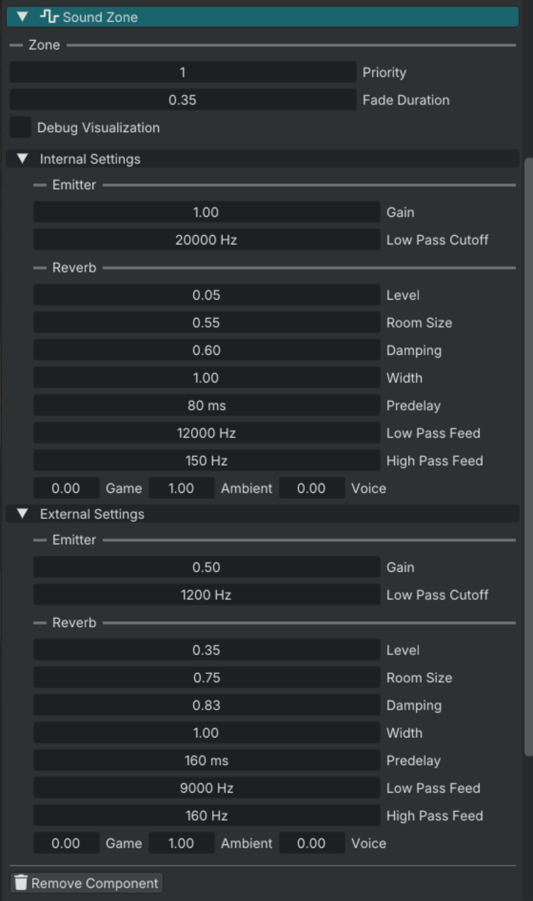

# Sound zone

A sound zone defines how opted-in sounds are heard while the **listener** is inside it. Mostly used for indoor reverb and muffling.

The listener position follows the active camera. 

Each zone has two profiles: 

- **Internal** is the room you are standing in. Sounds that belong inside the box with you, use **Internal Settings**. 

- **External** is how you hear the **outside** when you are inside the zone. A spatial source still playing outside the box uses **External Settings** so it can sound muffled or distant through the walls. 

The **Reverb** block on the component is the shared room (one tail for the whole zone). 

When the listener is outside every entity zone, the world **Default Sound Zone** in World Settings applies instead.

## Setup

1. Create an entity with a Sound Zone component. The transform scale is the box.
2. Set **Reverb** (shared room character).
3. Set **Internal Settings** for sources inside the box with the listener (and non-spatial beds).
4. Set **External Settings** for spatial sources outside the box while the listener is inside.

## Zone volume

| Widget | Purpose |
|--------|---------|
| Transform **Scale** | X / Y / Z size of the box. |
| **Debug Visualization** | Draw the box in the viewport. Not serialized with the world. |
| **Priority** | Higher wins when listener zones overlap. Can be negative. Ties use the lower entity id. |
| **Fade Duration** | Crossfade when the active listener zone changes (seconds). |

## Which profile applies

Routing only runs when **Affected By Zones** is on (Sound component or soundscape layer). GUI Sound components cannot opt in.

| Case | Result |
|------|--------|
| **Affected By Zones** off | Dry sound. No zone gain, no reverb send. Not the world default. |
| No entity zone | World **Default Sound Zone**. |
| Listener inside an entity zone, non-spatial / soundscape | **Internal**. |
| Listener inside, spatial source inside the box | **Internal**. |
| Listener inside, spatial source outside the box | **External**. |

World Default Sound Zone has no External profile.

## Reverb (shared room)

One wet bus per zone while the listener is inside. Tune it in the top **Reverb** group on the component (same layout on the world Default Sound Zone).

| Widget | Purpose |
|--------|---------|
| **Room Size** | Reverb space. |
| **Damping** | How quickly highs die in the tail. |
| **Width** | Stereo spread. |
| **Predelay** | Delay before the tail (ms). |
| **Low Pass Feed** / **High Pass Feed** | Filters on the reverb input. |

## Internal Settings

Used when the routing table picks **Internal** (see above).

**Emitter**

| Widget | Purpose | Range |
|--------|---------|-------|
| **Gain** | Multiplier on the source. |
| **Low Pass Cutoff** | Dry low-pass. |

**Reverb send**

| Widget | Purpose |
|--------|---------|
| **Level** | Send into the shared reverb (0 to 1). |
| **Game** / **Ambient** / **Voice** | Category multipliers. Final send is **Level × category send**. |

Example: Underwater-style muffling is often a low **Low Pass Cutoff** plus **Gain** below 1.

## External Settings

Used when the listener is inside the zone and the spatial source is **outside** the box.

**Emitter:** **Gain**, **Low Pass Cutoff** (same ranges as Internal).

**Reverb send:** **Level**, **Game** / **Ambient** / **Voice** (same idea as Internal). 

## World Default Sound Zone

World Settings → **Default Sound Zone**. Used when the listener is outside every entity zone. 

## Script API reference

- [Sound zone](../reference/sound_zone.md)
- [World soundzone](../reference/world_soundzone.md)

## Continue reading

**Previous:** [Soundscape](audio_soundscape.md): world beds and Soundscape Zones.

**Next:** [Music](audio_music.md): one global music stream from Lua.
