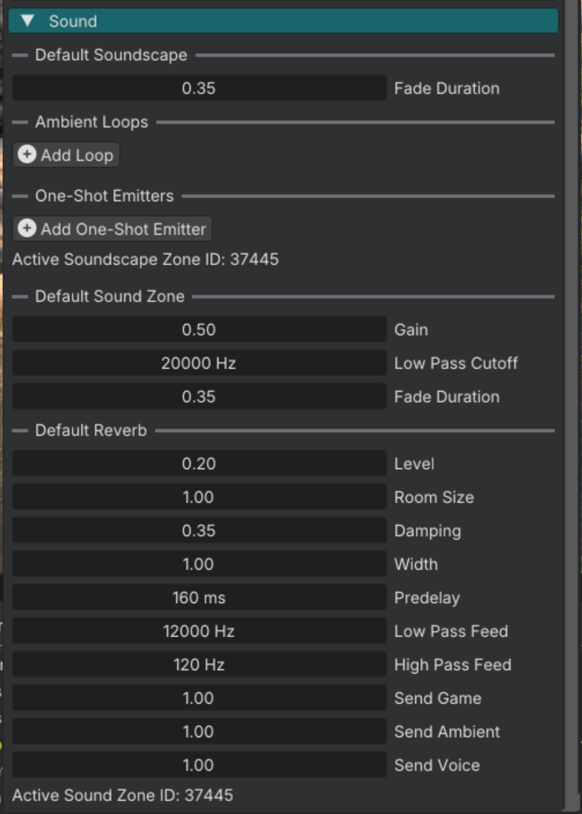

# Soundscape

Ambient beds: looping layers plus occasional one-shots. Routed through the **Ambient** category.

World Settings holds the default bed and the Default Sound Zone:

## When to use

Wind, rooms, streets, and other environment beds. Use Soundscape Zones when ambience should change by area.

## Setup

1. Set a **World Soundscape** in World Settings for the default bed.
2. Add Soundscape Zone entities where a different profile should win.
3. Add loop and one-shot layers on that profile.

## Loop layers

| Widget | Purpose |
|--------|---------|
| File | Continuous loop. |
| **Gain** | Linear loudness, 0 to 1. |
| **Pitch** | Playback rate. |
| **Affected By Zones** | Let Sound Zones process this loop. Default on. |

Loop pitch is an editor / JSON field. Lua profile tables do not round-trip it.

## One-shot layers

| Widget | Purpose |
|--------|---------|
| Files | List of files. One is picked at random each shot. |
| **Interval Min** / **Interval Max** | Seconds between shots. |
| **Gain** range | Linear loudness range per shot. |
| **Pitch** range | Pitch range per shot. |
| **Spatial Scatter** | Place the shot in 3D around the listener. |
| **Scatter Radius** | How far shots can spawn. |
| **Inner Radius** / **Outer Radius** | Attenuation when spatial. |
| **Affected By Zones** | Let Sound Zones process one-shots. Default on. |

## Soundscape zones

| Widget | Purpose |
|--------|---------|
| Profile | Layers used while the listener is inside this zone. |
| **Priority** | Higher wins when zones overlap. |
| **Fade Duration** | Crossfade when the active profile changes (seconds). |

## World soundscape

| Widget | Purpose |
|--------|---------|
| **World Soundscape** | Default profile when no Soundscape Zone applies. |

World soundscape fade duration has no Lua setter. Entity Soundscape Zones use `soundscape_zone_set_fade_duration`.

## Sound Zones

Soundscapes use the Ambient category. With **Affected By Zones** on, they take the listener entity zone (or the world Default Sound Zone). They are not excluded from entity zones.

## Notes

- Soundscapes pause with Game / Ambient / Voice.
- One-shots add variation. Keep intervals wide enough that they do not become a bed of their own.

## See also

- [Audio overview](audio.md)
- [Sound zone guide](audio_sound_zone.md)
- [Music guide](audio_music.md)
- [Soundscape zone API](../reference/soundscape_zone.md)
- [World soundscape API](../reference/world_soundscape.md)
