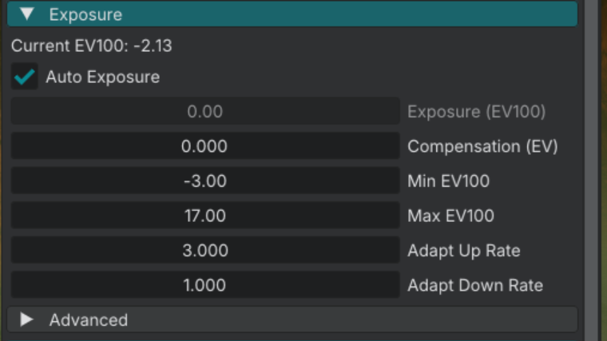

# Exposure & EV100

How brightness is measured, and how auto-exposure maps scene light to the image.

## Practical workflow

1. Set **Ambient Lux** and sun **Lux** to the gameplay baseline (2 and 6) unless you are in full physical mode.
2. Set auto-exposure **Min EV100** / **Max EV100**.
3. Add local lights.
4. Finish post-process after exposure is stable.

## Lumens and lux

Point / Spot use **Lumens**. Sun and sky fill use lux (**Lux**, **Ambient Lux**).

| Source | Typical |
|--------|---------|
| Candle | ~12 lm |
| 60W bulb | ~800 lm (local-light default) |
| Gameplay sun | **Lux** 6 |
| Sky fill | **Ambient Lux** 2 |
| Physical sun (optional) | ~100,000 lux |

There is no widget named "Sky ambient". Use **Ambient Lux**.

## EV100

Exposure scale is `exp2(-ev100)`.

Higher EV100 **darkens** the image. Lower EV100 **brightens** it.

| Widget | Meaning | Factory default |
|--------|---------|-----------------|
| **Min EV100** | Brightest the auto-exposure is allowed to go (lowest EV). | -3 |
| **Max EV100** | Darkest the auto-exposure is allowed to go (highest EV). | 17 |
| **Metering Key** | Target brightness. 0.18 is middle gray. | 0.18 |
| **Adapt Up Rate** | How fast exposure brightens when the scene gets darker. | 3.0 |
| **Adapt Down Rate** | How fast exposure darkens when the scene gets brighter. | 1.0 |
| **Center Weight** | How much the screen center drives metering. | 0.85 |
| **Compensation (EV)** | Manual offset in stops. | 0 |

Outdoor EV 10–16 is a **physical ~100k lux** range. Do not use it as a target for sun **Lux** 6.

One EV step is one stop (2×).

## Auto-exposure

When the frame is dark, EV falls toward **Min EV100** (image brightens). When the frame is bright, EV rises toward **Max EV100** (image darkens).

Lock **Min EV100** and **Max EV100** to the same value to pin a shot.

## Gameplay outdoor (sun 6, Ambient Lux 2)

Keep a wide factory range (-3 to 17) or a slightly tighter band that still covers interiors. Do not pin EV at 10–16 or the scaled sun will look too dark.

**Overcast / sunset:** lower **Lux**, lower **Ambient Lux**, warmer **Temperature (K)** (~3000K).

## Indoor

**Office:** several Point lights at 400–800 lm. A mid EV band is enough (for example min 2, max 10).

**Dark room / torch:** 50–200 lm. Let **Min EV100** go low so the camera can open up.

**Cave:** local lights only. Keep unlit space dark. Do not raise **Ambient Lux** to fake fill.

## Indoor / outdoor doors

1. Leave **Min EV100** low enough for interiors.
2. Leave **Max EV100** high enough that a bright exterior does not clip forever.
3. Use **Adapt Up Rate** / **Adapt Down Rate** for how fast the eye catches up.

If local lights vanish outdoors, lower sun **Lux** and **Ambient Lux** before raising every lumen value.

## Scripting

| Function | Widget |
|----------|--------|
| `renderer_set_auto_exposure_ev_min(ev)` | **Min EV100** |
| `renderer_set_auto_exposure_ev_max(ev)` | **Max EV100** |
| `renderer_set_auto_exposure_key(key)` | **Metering Key** |
| `renderer_set_auto_exposure_speed_up(speed)` | **Adapt Up Rate** |
| `renderer_set_auto_exposure_speed_down(speed)` | **Adapt Down Rate** |
| `renderer_set_auto_exposure_center_weight(weight)` | **Center Weight** |
| `renderer_set_auto_exposure_bias(ev)` | **Compensation (EV)** |
| `renderer_set_sky_ambient_lux(lux)` | **Ambient Lux** |

## See also

- [World sun](lighting_sun.md)
- [Light component](lighting_component.md)
- [Local shadows](lighting_local_shadows.md)
