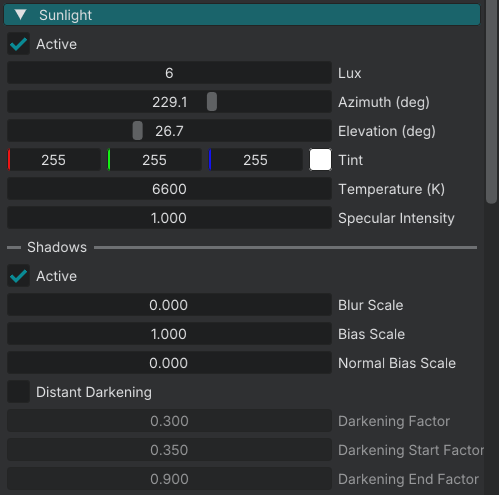

# World sun

One directional light for the whole world. Configure it in World Settings.

## Properties

World Settings sunlight widgets:

| Widget | Purpose |
|--------|---------|
| **Active** | Enable the sun. |
| **Lux** | Illuminance. |
| **Azimuth (deg)** | Compass angle, 0 to 360. |
| **Elevation (deg)** | Height above the horizon, -15 to 90. |
| **Tint** | RGB color. |
| **Temperature (K)** | Color temperature. |
| **Specular Intensity** | Highlight strength. |

The stored direction vector is light travel **into** the scene. `(0, -1, 0)` is noon (straight down). Lua `renderer_set_sunlight_direction` uses that vector.

Pair **Lux** with **Ambient Lux**. **Ambient Lux** is the sky fill widget in **Sky / Environment**, not "Sky ambient".

Full physical sun (~100,000 lux) is optional and needs a matching exposure range. Do not use outdoor EV 10–16 with sun lux 6.

## Shadows

World Settings shadow widgets:

| Widget | Purpose |
|--------|---------|
| **Active** | Enable sun shadows. |
| **Blur Scale** | Edge softness scale. |
| **Bias Scale** | Self-shadow offset scale. |
| **Normal Bias Scale** | Normal-offset scale. |

## Engine Settings
Cascade count and sun shadow **distance** come from Engine Settings **Shadow Quality**. They are not World Settings sliders.

| Shadow Quality | Cascades | Sun shadow distance | Local shadow max / fade |
|----------------|----------|---------------------|-------------------------|
| OFF | — | — | — |
| LOW | 1 | 50 m | 10 / 5 |
| MEDIUM | 2 | 100 m | 14 / 7 |
| HIGH | 3 | 100 m | 16 / 8 |
| ULTRA | 3 | 200 m | 24 / 12 |

Quality overwrites those distances at load. Near-cascade split is 0.1 × distance. Changing **Shadow Quality** needs an engine restart for map resolution and cascade count.

## Scripting

| Function | Purpose |
|----------|---------|
| `renderer_set_sunlight_active(active)` | Enable the sun. |
| `renderer_set_sunlight_lux(lux)` | Set **Lux**. |
| `renderer_set_sunlight_direction(direction)` | Set the travel-into-scene vector. |
| `renderer_set_sunlight_color(color)` | Set **Tint**. |
| `renderer_set_sunlight_temperature_k(kelvin)` | Set **Temperature (K)**. |
| `renderer_set_sunlight_specular_intensity(intensity)` | Set **Specular Intensity**. |
| `renderer_set_sunlight_shadow_active(active)` | Enable sun shadows. |
| `renderer_set_sunlight_shadow_bias(bias)` | **Bias Scale**. |
| `renderer_set_sunlight_shadow_blur(blur)` | **Blur Scale**. |
| `renderer_set_sky_ambient_lux(lux)` | Sky fill (**Ambient Lux**). |

## See also

- [Lighting overview](lighting.md)
- [Light component](lighting_component.md)
- [Local shadows](lighting_local_shadows.md)
- [Exposure & EV100](lighting_exposure.md)
- [Renderer API](../reference/renderer.md)
