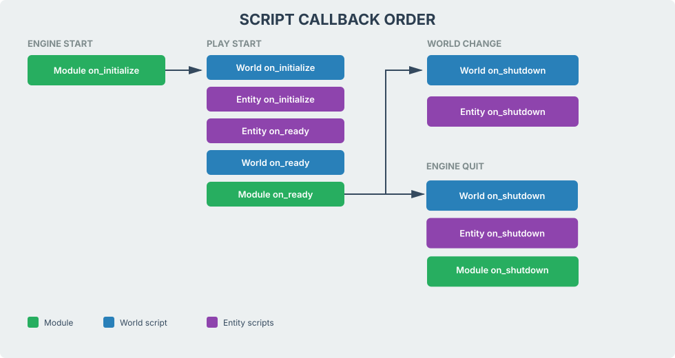

# Scripting overview

**Lua** scripts run your gameplay. Detis calls a certain number of functions on your scripts wautomatically. 

There are three places a script can live:

| Kind | Attached where | Stays loaded when you load another world? |
|------|------------------|-------------------------------------------|
| **Entity script** | **Script** component on one entity | No (per entity in the current world) |
| **World script** | The active **`.world`** | No (this world file only) |
| **Module script** | **View -> Module Manager** (writes **`content/config/modules.ini`**) | Yes (whole game) |

Each script file returns one **Lua table** filled with functions. 

Shared **`.lua`** files may be be used using **`dofile`** and are meant as libraries. They do not get engine callbacks.

Shipped **`content/scripts/`** is sample code. Use it, copy it. modify it, or delete it. It's up to you.

## Callbacks

**Callbacks** are functions on a script table the engine calls automatically if defined (**`on_ready`**, **`on_process`**, and so on). 

Implement only the callbacks you need. Remove any empty ones to maintain game performance, especially the per-frame ones.

| Callback | When | Typical use |
|----------|------|-------------|
| **`on_initialize`** | Called once, when the script instance is created | Initialize required script elements |
| **`on_ready`** | Called once, once world entities exist | Cache **`entity_id`**, read parameters, find other entities |
| **`on_process`** | Every frame (**`t_delta_time`**) | Timers, input, per-frame logic |
| **`on_fixed_process`** | Fixed physics step | Physics and movement |
| **`on_late_process`** | After **`on_process`** same frame | Follow targets that moved in **`on_process`** |
| **`on_draw`** | Render phase | Drawing in-game UI. Per-entity UI is rare |
| **`on_shutdown`** | Called once, before script removal | Cleanup |
| **`on_editor_mode_active`** | Editor vs play | Debug draws in the viewport |

Use **`on_process`** unless you need a fixed step. Add **`on_fixed_process`** when logic must match the physics timestep.

**`on_collision`** and **`on_overlap`** fire for physics contacts and triggers. They are separate from the table above.

## Callback order

Module **`on_initialize`** runs at engine start, before a world is loaded. It does not run again on a world change while the module stays loaded.

**`on_ready`** order is entity scripts, then the world script, then modules.

**`on_shutdown`** on a world change runs for the world script and entity scripts only. The module stays loaded. On engine quit, and when you leave **Play**, **`on_shutdown`** then runs for the module too, and the module is unloaded.

## Hot reload

In the Detis editor, use **Reload** on the **Script File** field in the script component or world proprties panels, or **Debug -> Reload Assets** (**`Shift+R`**) to reload scripts along with other assets without the need to restart the engine or editor. 

> **Note:** Automatic reload when a file changes on disk is planned.

## Continue reading

**Previous:** [Detis Engine Manual](index.md): manual home.

**Next:** [Lua editor setup](script_setup.md): VS Code and stubs.
