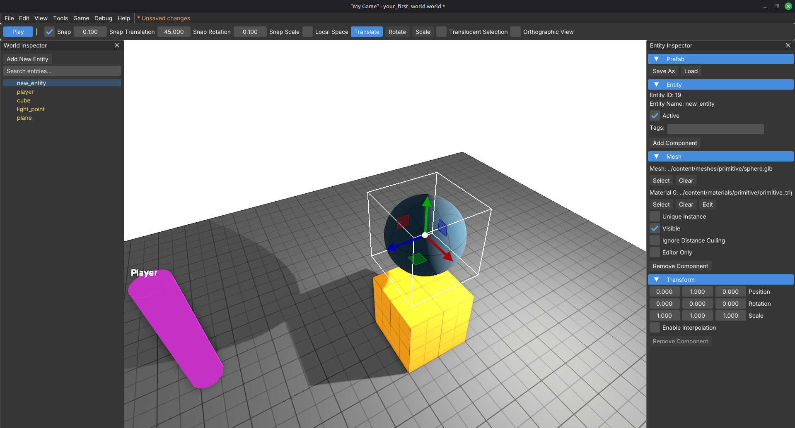
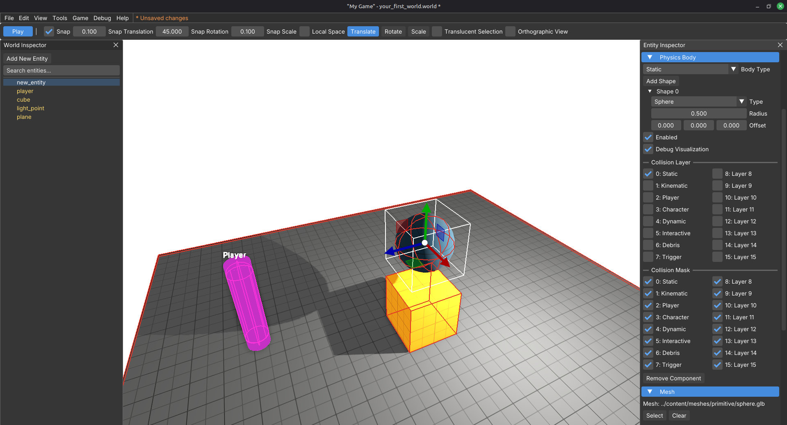

# Your first prefab

In [Your first world](your_first_world.md) you loaded ready-made `.entity` files. Now build one from components, save it as a prefab, and place it again from disk.

The package already has `sphere.glb` under `meshes/primitive/`, but there is no matching `sphere.entity` yet. That is the gap you will fill. Giving it collision now also sets you up to reuse this prefab as a ball in the next tutorial.

You should already have a saved tutorial world open. If not, do [Your first world](your_first_world.md) first.

## What a prefab is

A prefab is an `.entity` file: an entity (and optionally children) saved to disk. **Prefab → Load** instances it into the world. **Prefab → Save As** writes the selected entity out as a reusable asset.

Loading a prefab keeps the name already on that entity. Name first, then Load.

## 1. Add an empty entity

1. Open your tutorial world if it is not already loaded.
2. In the **World Inspector**, click **Add New Entity**.
3. Name it `sphere` when prompted (or rename it before you load anything).

New entities come with a **Transform**. That is enough to start.

## 2. Add a Mesh component

1. Select `sphere` in the World Inspector.
2. In the **Entity Inspector**, click **Add Component**.
3. Choose **Mesh**.

## 3. Point the mesh at the sphere

1. Open the **Mesh** section.
2. On the mesh file field, browse to `meshes/primitive/sphere.glb`.
3. On **Material 0**, pick `materials/primitive/primitive_triplanar_yellow.mat` so it feels consistent with the other primitive prefabs.

   The screenshots on this page use `materials/primitive/primitive_triplanar_dark_blue.mat` instead, so the sphere reads clearly against the yellow cube. Either is fine. Prefer yellow when you want the primitive set to match.

You should see a sphere in the viewport. The mesh is about `1` unit across (radius `0.5`). Move it beside your cube with **Transform** or the translate gizmo (**W**), and set Position Y to `1.5` so it sits on the cube.

## 4. Add collision

Keep this prefab **Static** for now. It is a solid prop. You will switch it to **Dynamic** when you script the kick in the next tutorial.

1. With `sphere` still selected, click **Add Component** again.
2. Choose **PhysicsBody**.
3. Open the **Physics Body** section.
4. Leave **Body Type** on **Static** (the default).
5. Open **Shape 0** (a default box shape is already there).
6. Set **Type** to **Sphere**.
7. Set **Radius** to `0.5` so it matches the mesh.

Leave mass and friction on the defaults. Dynamic mass and bounce matter more once the body can move.

## 5. Preview the collision shape

You want the wireframe sphere to line up with the mesh before you save the prefab.

**This entity only**

1. Still in **Physics Body**, enable **Debug Visualization**.
2. You should see this body's collision shape drawn in the viewport.

**Whole scene**

1. **Debug → Show Collision** (`Shift+C`), or press `Shift+C` in the viewport when you are not typing in a field.
2. That toggles collision debug for every physics body in the world (ground, cube, spheres, and so on).

Use whichever is handy. Per-entity debug is good while editing one shape. Scene-wide debug is good when you want to compare several bodies at once. Press `Shift+C` again (or **Debug → Hide Collision**) when you are done looking.

If the debug sphere does not match the mesh, fix **Radius** (and **Offset** if needed) before you save.

## 6. Save it as a prefab

1. With `sphere` still selected, open the **Prefab** section in the Entity Inspector.
2. Click **Save As**.
3. Browse to `entities/primitive/`.
4. Save as `sphere.entity`.

That file is now a reusable asset next to `cube.entity`, `plane.entity`, and the other primitives. Mesh, material, and collision travel with it.

## 7. Prove Load works

1. In the World Inspector, click **Add New Entity**.
2. Name it `sphere_2` before you load.
3. Prefab → **Load** → `entities/primitive/sphere.entity`.
4. Move the new instance so it is not sitting on top of the first one.

The entity should still be named `sphere_2`. Loading the prefab does not rename the root to the prefab’s default name.

You now have two spheres from one prefab file. Edits to an unlocked instance stay local until you save the prefab again. Lock, Unlock, Reset, and Break are covered in a later guide. For now, Load and Save As are the day-one loop.

## 8. Save the world

**File → Save World** (`Ctrl+S`) so the new entities stay in your map.

## 9. Play and check collision

1. **Game → Play Game** (`Ctrl+P` / `Alt+P`).
2. Walk into a sphere with the demo player. It should block you like a solid prop.
3. Static bodies stay put. They will not fall or roll yet.

Toggle back to the editor with the same play shortcut when you are done.

## Next

**[Kick the ball](kick_the_ball.md).** Make it Dynamic, attach an entity script, Interact, then edit and reload Lua.
