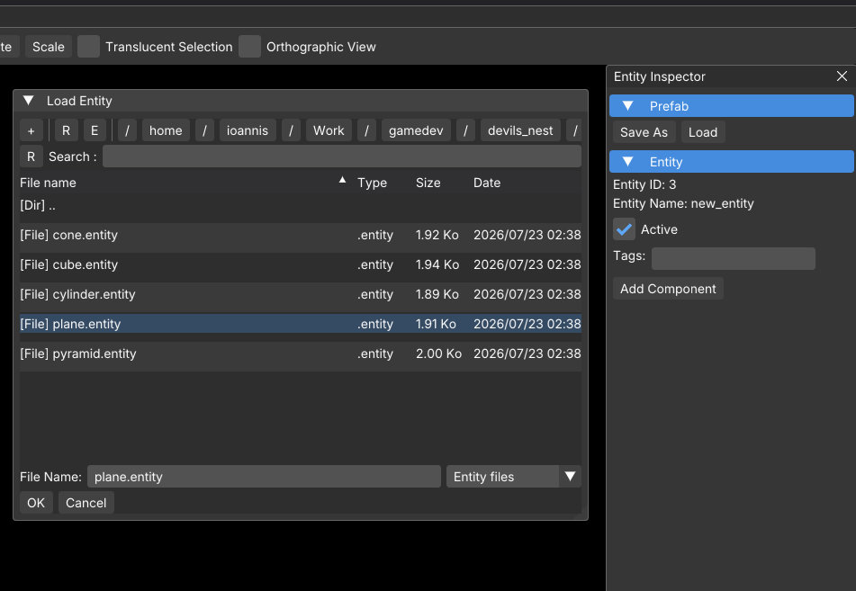
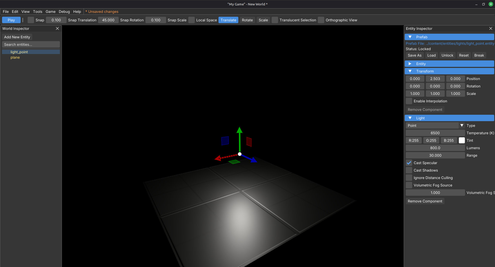
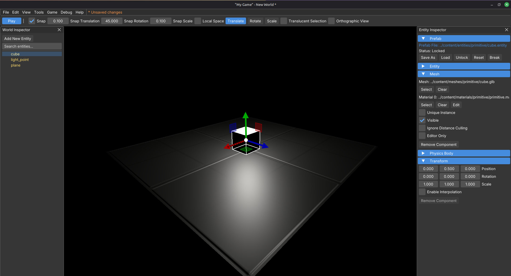
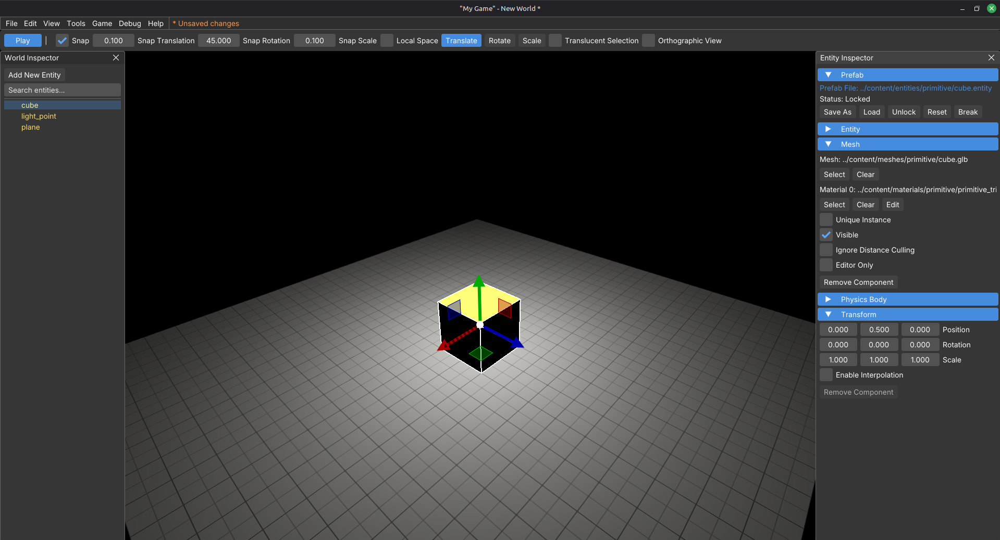
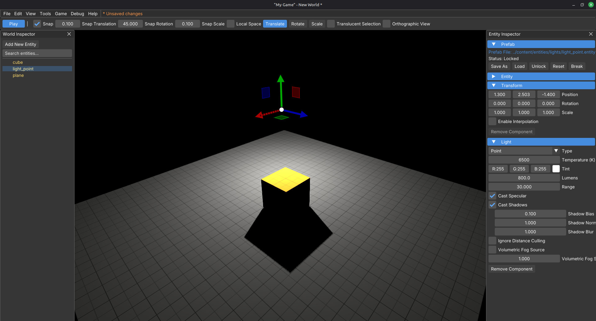
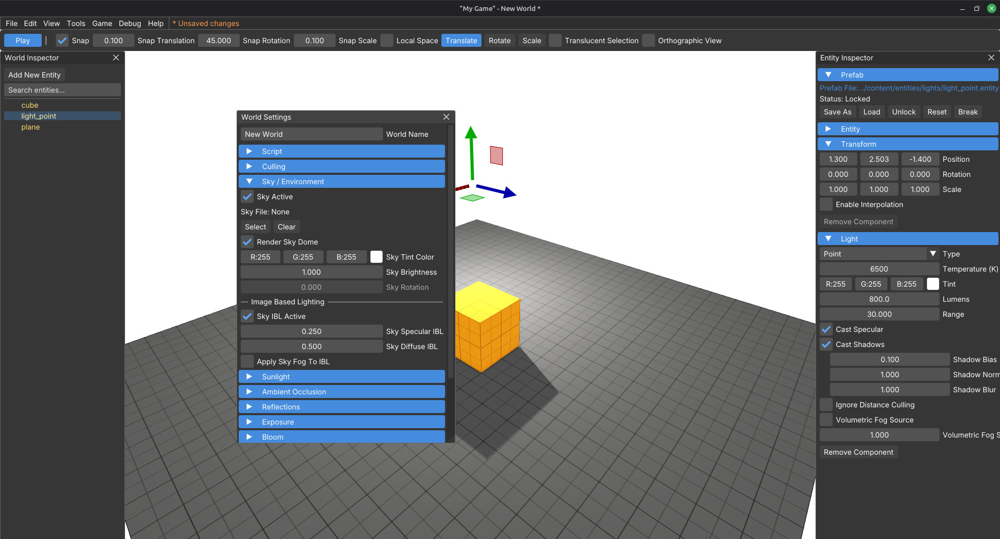
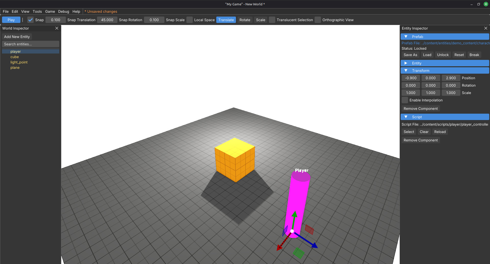
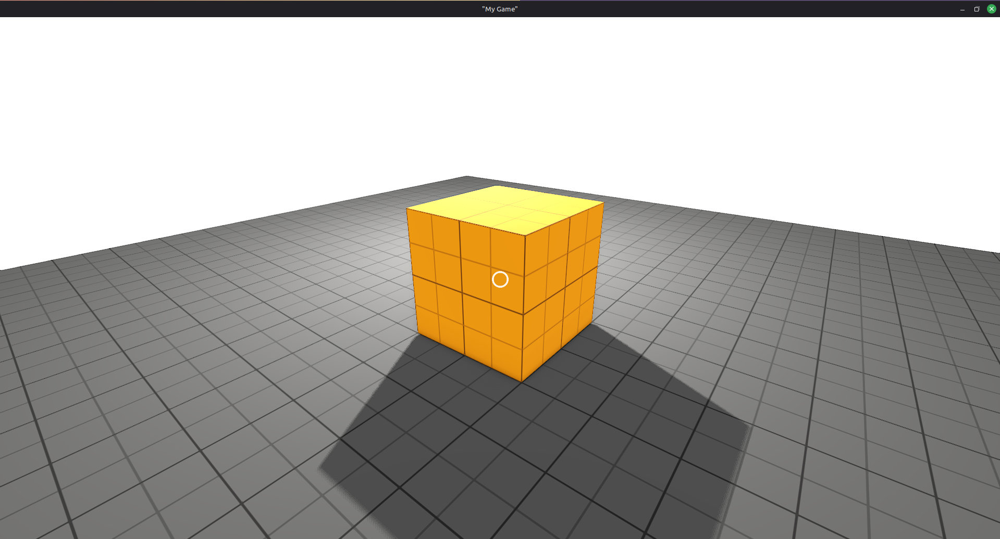

# Your first world

Build a small playable room from scratch: ground, light, a prop, materials, IBL, and the demo player.

A finished example ships at `content/worlds/tutorials/your_first_world.world` if you want to peek. This page walks you through building the same kind of scene yourself.

You should already know how to run the engine and move in the editor. If not, do [Quick start](../getting_started/quick_start.md) and [Editor overview](../getting_started/editor_overview.md) first.

> **Early Alpha Notice:** Detis began as an internal tool and is still early alpha, so there is no built-in content browser. You use the engine file dialog and your own OS file manager. That is total control over how your project is laid out, but also the responsibility to know where things live under `content/`. As the engine moves forward, especially if more developers pick it up, more advanced tools may appear. Until then, keep [Project layout](../getting_started/project_layout.md) handy.

## 1. New world

1. **File → New** (`Ctrl+N`).
2. Confirm when asked. You get an empty world.

## 2. Save it

1. **File → Save World As...** (`Ctrl+Shift+S`).
2. Browse under `content/worlds/` (file dialogs open in `content/` by default).
3. Create or open a `tutorials` folder if you want to match the package layout, then save as `your_first_world.world`.

Keeping the file under `content/worlds/` matches the rest of the package. See [Project layout](../getting_started/project_layout.md).

## 3. Open the hierarchy and inspector

1. **View → Show World Hierarchy** (`Shift+2`) if it is not already open. That opens the **World Inspector**.
2. **View → Show Entity Properties** (`Shift+3`) if it is not already open. That opens the **Entity Inspector**.

You create entities in the World Inspector and edit them in the Entity Inspector.

## 4. Add a ground plane

1. In the World Inspector, click **Add New Entity**.
2. Name it `ground` when prompted (or rename it before you load a prefab).
3. With that entity selected, open the **Prefab** section in the Entity Inspector.
4. Click **Load**.
5. Open `entities/primitive/plane.entity`.

Loading a prefab fills in components and children. It keeps the name you already set on this entity.

6. With the entity still selected, open the **Transform** section in the Entity Inspector and set:

   - Position: `0`, `0`, `0`
   - Rotation: `0`, `0`, `0`
   - Scale: `10`, `1`, `10`

   That makes the plane large enough for this tutorial.



You now have a ground mesh. It will look dark until you add a light.

## 5. Add a light

Add a point light so you can see the scene.

1. In the World Inspector, click **Add New Entity**.
2. Name it `light`.
3. Prefab → **Load** → `entities/lights/light_point.entity`.
4. Open **Transform** and place it above the ground, for example:

   - Position: `0.0`, `2.5`, `0.0`

   Use the translate gizmo (**W**) if you prefer to drag it into place.



> **Early Alpha Notice:** You cannot pick invisible entities in the viewport yet (lights, empty parents, and similar). Select them in the **World Inspector** first, then use the gizmo, or edit **Transform** in the Entity Inspector directly.

## 6. Add a cube

1. **Add New Entity** again. Name it `cube`.
2. Prefab → **Load** → `entities/primitive/cube.entity`.
3. Open **Transform** and set Position to `0`, `0.5`, `0` so the cube sits on the plane.



## 7. Apply materials

Materials live on the **Mesh** component. Each mesh slot has a **Material 0** (and more if the mesh has several slots).

1. Select `ground` in the World Inspector.
2. In the Entity Inspector, open the **Mesh** section.
3. On **Material 0**, browse and pick `materials/primitive/primitive_triplanar_dark_grey.mat`.
4. Select `cube`.
5. On **Material 0**, pick `materials/primitive/primitive_triplanar_yellow.mat`.



The ground and cube should now read clearly under the point light.

## 8. Enable point light shadows

1. Select `light`.
2. In the Entity Inspector, open the **Light** section.
3. Enable **Cast Shadows**.
4. Nudge the light horizontally in **Transform** (or with the translate gizmo after selecting it in the World Inspector) so it is not sitting directly above the cube. A bit of X or Z offset is enough.



The cube should cast a clear shadow across the ground. If the light is still on default range and lumens from the prefab, that is enough for this space.

## 9. Enable IBL scene lighting

Point lights alone leave the scene looking harsh. Image-based lighting (IBL) fills in ambient light from the sky.

1. **View → Show World Properties** (`Shift+4`). That opens **World Settings**.
2. Open **Sky / Environment**.
3. Enable **Sky Active** if it is off.
4. Under **Image Based Lighting**, enable **Sky IBL Active**.
5. Leave **Sky Diffuse IBL** and **Sky Specular IBL** on their defaults unless you want to experiment:

   - **Sky Diffuse IBL:** `0.5`
   - **Sky Specular IBL:** `0.25`



## 10. Add the demo player prefab

1. In the World Inspector, click **Add New Entity**.
2. Name it `player`.
3. Prefab → **Load** → `entities/demo_content/characters/player_character.entity`.
4. Move it onto the ground in front of the cube, for example Position `-0.9`, `0`, `2.9`.



You should see an editor-only player marker in the viewport. That is expected.

## 11. Save and play

1. **File → Save World** (`Ctrl+S`).
2. **Game → Play Game** (`Ctrl+P` / `Alt+P`), or **Play** on the transform bar.
3. Walk around with the demo player controls, look at the lit cube, then toggle back to the editor with the same play shortcut.



## Optional: boot into this world next time

In `game/content/config/default_game.ini`:

```ini
[Core]
default_world = ../content/worlds/tutorials/your_first_world.world
```

Restart the executable. The editor should open with this world loaded.

## Next

**[Your first prefab](your_first_prefab.md).** Build a sphere from components, save it, and load it again.
